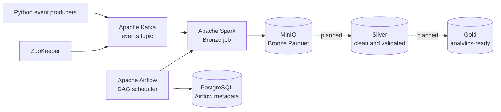
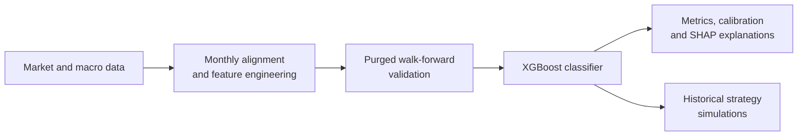

# Data Engineering & Financial ML Platform


A **Proof of Concept (PoC)** platform combining **data engineering** and **applied financial machine learning** across two decoupled architectural modules:
1. A containerised Lakehouse data pipeline (Kafka, Spark, MinIO, Airflow) for synthetic streaming event ingestion and Bronze-layer partitioning.
2. An independent quantitative research & ML engine (XGBoost, SHAP) with temporal walk-forward validation and macroeconomic regime forecasting.

> **Project Nature & Scope:** Built as an academic Proof of Concept (TFG) for learning, experimentation, and portfolio demonstration. The data engineering infrastructure and ML research engine are designed as modular, decoupled systems to study each domain in depth before unified end-to-end integration. It is not production infrastructure or financial advice.

## What this project demonstrates

| Data Engineering | Data Science & ML |
| --- | --- |
| Containerised local infrastructure with Docker Compose | Financial and macroeconomic data preparation |
| Event ingestion and buffering with Apache Kafka | Feature engineering for time-series classification |
| Workflow orchestration with Apache Airflow | Chronological walk-forward validation |
| Distributed processing with Apache Spark | XGBoost modelling and calibration analysis |
| S3-compatible, partitioned Parquet storage in MinIO | SHAP-based model explainability |
| Bronze/Silver/Gold lakehouse design | Strategy simulation and risk/turnover metrics |

## Architecture and workflows

The repository contains two complementary but operationally independent workstreams.

### 1. Data engineering platform



Two producers generate JSON events and publish them to Kafka. Airflow schedules a Spark batch job, which reads the configured time window, applies a typed schema, creates calendar partitions, and appends the resulting Parquet dataset to MinIO.

### 2. Financial ML research



This workflow runs as standalone research code under [`models/`](models/); it is not currently orchestrated by Airflow or connected to the lakehouse pipeline.

## Implementation status

| Area | Status | Available today |
| --- | --- | --- |
| Local infrastructure | Implemented | Docker Compose services for Airflow, Kafka, Spark, MinIO, PostgreSQL, and ZooKeeper |
| Event ingestion | Implemented | Two synthetic Python producers and Kafka topic initialisation |
| Bronze layer | Implemented | Time-windowed Kafka processing and partitioned Parquet writes to MinIO |
| Silver and Gold layers | Scaffolding | Spark files and MinIO buckets exist; transformations are planned |
| Financial data acquisition | Implemented | Standalone scripts for selected market and macroeconomic series |
| Financial modelling | Implemented research workflow | Feature engineering, XGBoost, walk-forward evaluation, calibration, and SHAP |
| Strategy comparison | Implemented research workflow | Rule-based, DCA, and modified value-averaging simulations |

## Technology stack

| Component | Purpose |
| --- | --- |
| Docker Compose | Reproducible local infrastructure |
| Apache Airflow | Workflow orchestration and scheduling |
| Apache Kafka | Event streaming and buffering |
| Apache Spark | Distributed batch processing |
| MinIO | S3-compatible object storage |
| PostgreSQL | Airflow metadata database |
| ZooKeeper | Kafka coordination in the local environment |
| Python | Producers, utilities, and financial analytics |
| XGBoost and SHAP | Classification and model explainability |

## Repository map

```text
airflow/dags/             Airflow DAG definitions
docker/                   Dockerfiles and Compose configuration
kafka/                    Synthetic Kafka event producer
models/                   Financial data, ML, and strategy scripts
spark/                    Bronze job, future Silver/Gold jobs, and Spark config
sql/                      MinIO initialisation utilities
.env.example              Required environment variables
```

## Quick start

### Prerequisites

- Docker Desktop with Docker Compose v2.
- At least 8 GB of RAM allocated to Docker is recommended.
- Python 3.10+ to run the standalone financial scripts outside the containers.

Create the local environment file:

```bash
cp .env.example .env
```

On Windows PowerShell:

```powershell
Copy-Item .env.example .env
```

Review `.env` before starting. The Compose setup expects MinIO credentials, an Airflow username, and a scheduling window:

```dotenv
MINIO_ROOT_USER=minioadmin
MINIO_ROOT_PASSWORD=change-me
AIRFLOW_USERNAME=admin
WINDOW=5
```

Start the platform from the repository root:

```bash
docker compose -f docker/docker-compose.yml --env-file .env up --build
```

Add `-d` before `--build` to run it in the background.

### Local services

| Service | URL or address | Purpose |
| --- | --- | --- |
| Airflow | http://localhost:8081 | Workflow UI |
| Spark Master | http://localhost:8080 | Cluster and job status |
| MinIO API | http://localhost:9000 | S3-compatible endpoint |
| MinIO Console | http://localhost:9001 | Object storage UI |
| Kafka | http://localhost:9092 | Local broker endpoint |

Use the credentials configured in `.env`.

## Engineering highlights

### Orchestrated event processing

[`airflow/dags/lakehouse_pipeline.py`](airflow/dags/lakehouse_pipeline.py) defines the `lakehouse_pipeline` DAG and submits the Bronze Spark job with the Kafka, MinIO, and time-window configuration.

[`kafka/kafka_producer.py`](kafka/kafka_producer.py) publishes synthetic events such as:

```json
{
  "user_id": 12,
  "product": "A",
  "price": 45.60,
  "timestamp": 1710000000.0
}
```

[`spark/spark_bronze.py`](spark/spark_bronze.py) parses each payload into a typed schema, filters it using the Airflow-provided window, derives `year`, `month`, `day`, and `hour` partitions, and appends Parquet data to `s3a://bronze/eventos_batch`.

### Time-aware financial modelling

The research workflow deliberately uses chronological evaluation rather than a random train/test split:

1. [`get_data.py`](models/get_data.py) acquires selected historical market and macroeconomic series.
2. [`run_pipeline.py`](models/run_pipeline.py) / [`predictions.py`](models/predictions.py) aligns series to a monthly frequency and builds lagged macroeconomic, valuation, momentum, and technical features.
3. A forward-return label is created for the configured horizon and excluded from the predictors.
4. Purged walk-forward folds train on past observations and evaluate on later periods with temporal embargo.
5. Out-of-sample predictions are assessed with classification, calibration, stability, risk, and turnover metrics.
6. A final model produces feature-importance and SHAP explanations for interpretation (see [`models/README.md`](models/README.md)).
7. [`compare_strategies_simple.py`](models/compare_strategies_simple.py) compares moving-average and RSI rules with DCA and modified value averaging.

Generated research artefacts include CSV summaries and diagnostic, calibration, feature-importance, SHAP, and strategy-comparison charts. No performance figure is presented here because results depend on the selected data, horizon, parameters, costs, and evaluation period.

## Useful commands

```bash
# Check running services
docker compose -f docker/docker-compose.yml ps

# Follow all logs
docker compose -f docker/docker-compose.yml logs -f

# Follow one service
docker compose -f docker/docker-compose.yml logs -f airflow

# Stop containers without removing them
docker compose -f docker/docker-compose.yml stop

# Stop and remove containers and networks
docker compose -f docker/docker-compose.yml down
```

Avoid `docker compose down -v` unless you intentionally want to delete the local database and object-storage volumes.

## Limitations

- **Decoupled Architecture (Data Pipeline vs. ML Engine):** The data engineering platform (Airflow/Spark/MinIO) and the ML research workflow operate as decoupled modules. The lakehouse pipeline processes synthetic streaming telemetry, whereas the ML engine trains on historical market and macroeconomic datasets.
- The platform is designed for local development, not production deployment.
- Kafka runs as a single broker with replication factor one and ZooKeeper coordination.
- MinIO uses HTTP inside the Docker network.
- Silver and Gold transformations are not implemented yet.
- The financial workflows are research artefacts, not live trading systems or investment recommendations.
- Historical simulations remain sensitive to data quality, parameter selection, transaction costs, and market-regime changes.

## Roadmap

- Implement Silver cleaning, validation, and deduplication.
- Build Gold aggregates and analytics-ready tables.
- Unify data lakehouse and ML research workflows via a dedicated Feature Store layer.
- Integrate automated MLOps retraining and inference DAGs in Airflow with experiment tracking.
- Add automated data-quality checks and tests.
- Add pipeline observability and freshness monitoring.
- Replace the local ZooKeeper-based Kafka setup with a production-oriented coordination approach.
- Add a locked and reproducible dependency definition for the financial environment.

## License

This project is licensed under the [MIT License](LICENSE).
