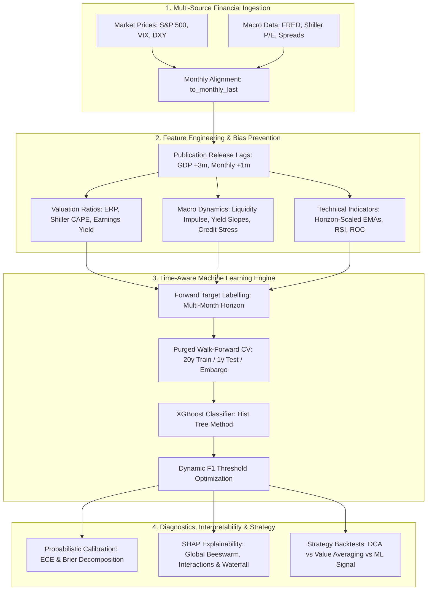
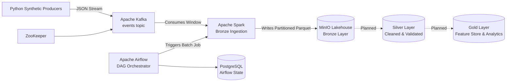

# Financial time series forecasting with XGBoost


[](https://github.com/Arqaen/data-pipeline-management/actions/workflows/ci.yml)


-C72E49?logo=minio&logoColor=white)


A rigorous, time-aware quantitative machine learning framework designed to forecast long-term macroeconomic regimes and directional trends for the **S&P 500 index**. The platform integrates multi-source macroeconomic and valuation signals, prevents lookahead bias via publication release lags, enforces purged walk-forward temporal cross-validation, and provides granular model explainability through SHAP.

Additionally, the repository features an exploratory **Data Engineering Proof of Concept (PoC)** demonstrating containerized, distributed streaming ingestion and lakehouse storage (Kafka, Spark, Airflow, MinIO).

---

## Table of Contents

- [Core Analytical Focus: Financial Machine Learning](#core-analytical-focus-financial-machine-learning)
  - [Quantitative Problem Formulation](#quantitative-problem-formulation)
  - [Macroeconomic & Market Data Engine](#macroeconomic--market-data-engine)
  - [Zero Lookahead Bias & Publication Release Lags](#zero-lookahead-bias--publication-release-lags)
  - [Feature Engineering Taxonomy](#feature-engineering-taxonomy)
- [Modeling & Validation Architecture](#modeling--validation-architecture)
  - [Target Variable Construction](#target-variable-construction)
  - [Purged Walk-Forward Cross-Validation & Temporal Embargo](#purged-walk-forward-cross-validation--temporal-embargo)
  - [XGBoost Optimization & Dynamic Threshold Tuning](#xgboost-optimization--dynamic-threshold-tuning)
  - [Probabilistic Calibration & Evaluation Metrics](#probabilistic-calibration--evaluation-metrics)
  - [Explainable AI (XAI) via Tree SHAP](#explainable-ai-xai-via-tree-shap)
- [Quantitative Strategy Simulation & Benchmarking](#quantitative-strategy-simulation--benchmarking)
- [Data Engineering Proof of Concept (PoC)](#data-engineering-proof-of-concept-poc)
  - [Streaming & Lakehouse Ingestion Pipeline](#streaming--lakehouse-ingestion-pipeline)
  - [Decoupled Architecture Rationale](#decoupled-architecture-rationale)
- [Tech Stack](#tech-stack)
- [Project Structure](#project-structure)
- [How to Run](#how-to-run)
  - [1. Quantitative ML Research Pipeline](#1-quantitative-ml-research-pipeline)
  - [2. Data Engineering Infrastructure (PoC)](#2-data-engineering-infrastructure-poc)
- [Research Artifacts & Diagnostic Outputs](#research-artifacts--diagnostic-outputs)
- [Roadmap](#roadmap)
- [License & Disclaimer](#license--disclaimer)

---

## Core Analytical Focus: Financial Machine Learning



### Quantitative Problem Formulation

Financial time series exhibit non-stationarity, regime shifts, and low signal-to-noise ratios. Standard short-term predictive setups often degenerate into noise fitting. 

This project formulates market directional forecasting as a **macroeconomic regime classification task** over a medium-to-long-term forecast horizon (default: **36 months** / 3 years). By modeling the fundamental macroeconomic cycle—monetary liquidity, credit spreads, real interest rates, and structural equity valuations—the objective is to estimate the conditional probability:

$$\mathbb{P}\left(\text{Close}_{t+h} > \text{Close}_t \mid \mathcal{F}_t\right)$$

where $\mathcal{F}_t$ represents the information filtration available at calendar time $t$ without future leakage.

---

### Macroeconomic & Market Data Engine

The ML engine integrates 28+ monthly and quarterly macroeconomic, monetary, credit, and market series spanning over 70 years of historical data:

| Domain | Series & Indicators | Analytical Significance |
| :--- | :--- | :--- |
| **Broad Market** | S&P 500 (`Close`), VIX (`VIX_Close`), US Dollar Index (`DXY`) | Equity trend, volatility regime, currency pressure |
| **Valuation** | S&P 500 P/E Ratio, Shiller CAPE Ratio | Mean-reversion baselines and structural over/undervaluation |
| **Economic Growth** | Real GDP (`GDPC1`), Unemployment Rate (`UNRATE`), Total Vehicle Sales (`TOTALSA`) | Macro cycle phase identification and recession tracking |
| **Monetary & Liquidity** | M2 Money Supply (`M2SL`), Fed Balance Sheet (`WALCL`), Effective Fed Funds Rate (`FEDFUNDS`) | Central bank liquidity expansion/contraction cycles |
| **Interest Rates & Yields** | 10Y Treasury Yield (`DGS10`), 10Y-3M Spread (`T10Y3M`), 10Y-2Y Spread (`T10Y2Y`), 10Y TIPS (`DFII10`) | Yield curve inversions, term premia, real discount rates |
| **Inflation Expectations** | 10Y Breakeven Inflation (`T10YIE`), Atlanta Fed Sticky CPI (`CORESTICKM159SFRBATL`) | Long-term inflation pricing and structural inflation regimes |
| **Credit & Risk Premia** | Moody's Baa/Aaa Spreads (`BAA`, `AAA`), High Yield Spreads (`BAMLH0A0HYM2`), Chicago Fed NFCI | Corporate default risk, market stress, and credit contraction |
| **Housing & Leading Indicators** | Building Permits (`PERMIT`), Housing Starts (`HOUST`), Leading Index (`USSLIND`) | Early-cycle macroeconomic leading activity |

---

### Zero Lookahead Bias & Publication Release Lags

A critical failure mode in academic and financial machine learning is **lookahead bias** (*data leakage*): training models with economic data timestamped on reference dates rather than when the data was actually published to market participants.

To guarantee zero lookahead bias, this framework enforces strict **publication release lags** before feature calculation:

- **Quarterly GDP (`GDPC1`):** Shifted by $+3$ months (quarterly reporting and revision delay).
- **Monthly Indicators (`UNRATE`, `PERMIT`, `M2SL`, `HOUST`, `TOTALSA`, `WALCL`, `CORESTICKM159SFRBATL`):** Shifted by $+1$ month.
- **Historical Coverage Filtering:** Features are verified against a minimum non-null history ratio (`MIN_HISTORY_RATIO = 0.6`) to avoid survivorship bias and artificial imputation artifacts.

---

### Feature Engineering Taxonomy

The feature engine transforms raw series into horizon-adapted, economically grounded predictors across five key domains:

```text
Feature Engineering Pipeline
├── 1. Valuation & Risk Premia
│   ├── Equity Risk Premium (ERP):  ERP = (1 / P/E) - 10Y Treasury Yield
│   ├── S&P 500 Earnings Yield:     EY = 1 / P/E
│   ├── CAPE Earnings Yield:        CAPE_EY = 1 / CAPE
│   └── Value-Momentum Interaction: EY * Rate_of_Change(h)
│
├── 2. Monetary & Liquidity Dynamics
│   ├── M2 Year-over-Year Growth:   M2_YoY = pct_change(M2, 12)
│   ├── Liquidity Impulse:          M2_YoY - GDP_YoY
│   ├── Central Bank Balance Trend: pct_change(WALCL, 6) - pct_change(WALCL, 12)
│   └── Fed Funds 3-Month Change:   diff(FEDFUNDS, 3)
│
├── 3. Credit Stress & Yield Curves
│   ├── Corporate Credit Spread:    BAA - AAA
│   ├── High-Yield Spread Momentum: diff(BAMLH0A0HYM2, 3)
│   ├── Credit Impulse & Stress:    -diff(HY_Spread, 12) / diff(HY_Spread, 6)
│   ├── Yield Curve Slopes:         10Y Yield - 3M T-Bill (T10Y3M) / 10Y-2Y
│   └── Real Interest Rate:         10Y TIPS - Sticky CPI Core
│
├── 4. Volatility & Sentiment
│   ├── VIX Level & 3-Month Trend:  pct_change(VIX, 3)
│   ├── VIX 12-Month Rolling Z-Score: (VIX - MA12(VIX)) / STD12(VIX)
│   └── Volatility Regime Ratio:    VIX / MA12(VIX)
│
└── 5. Horizon-Scaled Technical Momentum
    ├── Adaptive EMAs:              EMA(short=h/2), EMA(mid=h), EMA(long=2*h)
    ├── EMA Distance & Spreads:     Close / EMA(mid) - 1.0, EMA(short) / EMA(long) - 1.0
    ├── 14-Month Rolling RSI:       Relative Strength Index on monthly close
    ├── Horizon Rate of Change:     ROC(h) = (Close_t / Close_{t-h}) - 1.0
    └── 12-Month Rolling Drawdown:  Close_t / max(Close_{t-12..t}) - 1.0
```

---

## Modeling & Validation Architecture

### Target Variable Construction

For a given prediction horizon $h$ (e.g., $h = 36$ months):
- **Continuous Log-Return (Regression Target):**
  $$
  y_{\text{reg}, t} = \ln\left(\frac{\text{Close}_{t+h}}{\text{Close}_t}\right)
  $$
- **Binary Directional Label (Classification Target):**
  $$
  y_{\text{cls}, t} = \mathbb{I}\left(\text{Close}_{t+h} > \text{Close}_t\right) = \begin{cases} 1 & \text{if forward return } > 0 \\ 0 & \text{otherwise} \end{cases}
  $$

All target calculations are strictly excluded from the feature space during model training.

---

### Purged Walk-Forward Cross-Validation & Temporal Embargo

Standard $K$-Fold cross-validation is fundamentally flawed for financial time series: it randomly samples observations, inducing lookahead bias and serial correlation leakage. When predicting multi-step forward returns ($h > 1$), overlapping label windows introduce severe dependency between adjacent samples.

To address this, this framework implements **Purged Walk-Forward Temporal Cross-Validation with Embargo**:

```text
Time Axis ──────────────────────────────────────────────────────────────────────────►
Fold 1: [==== Training History (20+ Years) ====][-- Purge/Embargo --][ Test Fold (1 Year) ]
Fold 2: [====== Expanding Training History ======][-- Purge/Embargo --][ Test Fold (1 Year) ]
Fold N: [======== Expanding Training History ========][-- Purge/Embargo --][ Test Fold (1 Year) ]
Final:  [================ Full Historical Training ================][-- Gap --][ Final Rollout (10 Years) ]
```

1. **Expanding Window Training:** Minimum initial training history of 240 months (20 years) to capture multiple macroeconomic cycles.
2. **Purging & Embargo:** Observations within the overlapping $h$-month forward window are purged before the evaluation fold.
3. **Internal Temporal Validation:** Each training split isolates its last 20% chronologically for:
   - Early stopping regularization (`early_stopping_rounds = 100`).
   - Out-of-fold optimal classification threshold calibration.
4. **10-Year Out-of-Sample Final Rollout:** An isolated 120-month final testing block separated by a 36-month embargo gap evaluates real-world regime stability and out-of-sample degradation.

---

### XGBoost Optimization & Dynamic Threshold Tuning

- **Base Estimator:** `XGBClassifier` with histogram-based tree splitting (`tree_method = "hist"`), log-loss objective (`binary:logistic`), and tree depth limits to prevent overfitting.
- **Regularization:** L1 penalty (`reg_alpha`), L2 penalty (`reg_lambda`), conservative learning rates ($\eta \in [0.03, 0.07]$), and sub-sampling ratios (`subsample = 0.9`, `colsample_bytree = 0.8`).
- **Dynamic Decision Threshold ($p^*$):** Instead of assuming a naive $p = 0.5$ classification cutoff, the engine searches for the threshold $p^* \in [0.20, 0.80]$ that maximizes the $F_1$-score on internal temporal validation data, preventing class-imbalance distortion.

---

### Probabilistic Calibration & Evaluation Metrics

Model performance is evaluated using both probabilistic and financial criteria:

```text
Evaluation Metrics Suite
├── 1. Probabilistic Calibration
│   ├── Expected Calibration Error (ECE)
│   ├── Brier Score Decomposition: Brier = Reliability - Resolution + Uncertainty
│   └── Decile Calibration Curves & Quantile Reliability Tables
│
├── 2. Classification & Discrimination
│   ├── ROC-AUC & Precision-Recall AUC (PR-AUC)
│   ├── Macro / Weighted / Directional F1-Score
│   ├── Balanced Accuracy & Matthews Correlation Coefficient (MCC)
│   └── Lift@K and Precision@Top Deciles
│
└── 3. Financial & Investment Metrics
    ├── Compound Annual Growth Rate (CAGR)
    ├── Annualized Volatility & Sharpe Ratio
    ├── Maximum Drawdown (MDD) & Calmar Ratio
    └── Strategy Exposure & Turnover Rate
```

> [!WARNING]
> **Known Limitations:**
> The 36-month horizon over monthly data yields ~20 independent observations and an 82.9% base rate; reported metrics are point estimates without confidence intervals and should be read as directional, not conclusive. Feature selection was informed by full-sample analysis, so walk-forward results are optimistic.

---

### Explainable AI (XAI) via Tree SHAP

To prevent the model from operating as a black box, the framework uses `shap.TreeExplainer` for end-to-end interpretability:

- **Global Feature Importance:** Mean absolute SHAP values ($E[|\phi_i|]$) revealing dominant macroeconomic drivers over 70+ years.
- **SHAP Beeswarm Distributions:** Directional impact of features (e.g., how high credit spreads or contracting M2 decrease positive return probabilities).
- **Non-Linear Interactions:** Automatic pair-wise interaction analysis (e.g., Equity Risk Premium conditioned on real interest rates).
- **Local Waterfall Decompositions:** Single-observation breakdown for the most recent market regime, visualizing the contribution of each live economic variable to the latest prediction.

---

## Quantitative Strategy Simulation & Benchmarking

The ML model's probabilistic outputs are translated into continuous allocation signals and benchmarked against standard quantitative investment strategies:

1. **Continuous Probability-Weighted Strategy:** Allocates capital proportionally to the model's forward return probability:
   $$\text{Weight}_t = f(\mathbb{P}(\text{Bull}_t))$$
2. **Dollar-Cost Averaging (DCA):** Systematic fixed monthly capital injection benchmark.
3. **Modified Value Averaging:** Dynamic contribution rule scaling purchases counter-cyclically relative to target portfolio trajectories.
4. **Rule-Based Moving Average & RSI Models:** Classic trend-following benchmarks (e.g., 200-day EMA crossover and 14-month RSI oversold/overbought triggers).

---

## Data Engineering Proof of Concept (PoC)

> [!NOTE]
> **Architectural Scope & Transparency:**
> The lakehouse infrastructure described below currently operates as an **exploratory Proof of Concept (PoC)**. It is **architecturally decoupled** from the standalone Machine Learning engine and serves as an engineering testbed to explore scalable, containerized streaming ingestion and partitioned storage for enterprise environments.

### Streaming & Lakehouse Ingestion Pipeline



The PoC implements a Medallion-architecture ingestion pattern:

- **Streaming Event Ingestion (Apache Kafka):** Synthetic Python producers publish high-throughput JSON financial events to a partitioned Kafka topic.
- **Distributed Batch Processing (Apache Spark):** Spark batch consumers extract windowed event streams, enforce explicit schemas, generate calendar partitions (`year`, `month`, `day`, `hour`), and write partitioned Snappy-compressed Parquet datasets to S3 storage.
- **Workflow Orchestration (Apache Airflow):** Airflow DAGs (`lakehouse_pipeline.py`) coordinate execution windows, parameter injection, and Spark job submissions.
- **Object Storage (MinIO):** S3-compatible local lakehouse managing `s3a://bronze/`, `s3a://silver/`, and `s3a://gold/` storage buckets.

### Decoupled Architecture Rationale

Separating the research engine from the distributed lakehouse allows:
1. **Rapid Research Iteration:** Fast quantitative experimentation on curated historical macroeconomic time series without streaming overhead.
2. **Infrastructure Scalability:** A proven distributed ingestion blueprint (Kafka $\to$ Spark $\to$ MinIO) ready to scale into real-time tick/order-book data pipelines.
3. **Future Unification:** Clear roadmap path to bridge both systems via a centralized **Feature Store** (e.g., Feast) and automated Airflow MLOps training DAGs.

---

## Tech Stack

| Domain | Technology | Purpose |
| :--- | :--- | :--- |
| **Machine Learning** | `XGBoost` | Gradient boosted decision trees for time series classification |
| **Model Explainability** | `SHAP` | Game-theoretic TreeExplainer for feature attribution |
| **Scientific Computing** | `scikit-learn`, `pandas`, `numpy`, `scipy` | Feature engineering, calibration metrics, array computation |
| **Data Visualization** | `matplotlib`, `seaborn` | High-resolution scorecards, calibration plots, equity curves |
| **Data Acquisition** | `yfinance`, `pandas_datareader`, `requests` | Historical market and macroeconomic data ingestion |
| **Workflow Orchestration**| `Apache Airflow` | DAG scheduling, task dependency management, and monitoring |
| **Distributed Computing** | `Apache Spark` (PySpark) | Large-scale event processing, schema enforcement, Parquet writes |
| **Event Streaming** | `Apache Kafka`, `ZooKeeper` | High-throughput streaming broker and distributed coordination |
| **Lakehouse Storage** | `MinIO` (S3 API) | Partitioned object storage for Medallion lakehouse layers |
| **Database & Metadata** | `PostgreSQL` | Metadata storage backend for Apache Airflow |
| **Containerization** | `Docker`, `Docker Compose` | Reproducible multi-service local infrastructure |

---

## Project Structure

```text
.
├── models/                           # 🧠 PRIMARY ANALYTICAL & ML ENGINE
│   ├── src/                          # Core modular package
│   │   ├── config.py                 # Hyperparameters, horizons, feature lists & paths
│   │   ├── data_loader.py            # Financial data ingestion, cleaning & frequency resampling
│   │   ├── features.py               # Feature engineering, publication lags & target creation
│   │   ├── walk_forward.py           # Purged Walk-Forward CV engine with temporal embargo
│   │   ├── rollout.py                # 10-Year out-of-sample final rollout evaluation
│   │   ├── tuning.py                 # Time-aware hyperparameter random search
│   │   ├── explainability.py         # SHAP interpretability, tree explanations & live inference
│   │   ├── simulation.py             # Quantitative strategy simulators (DCA, VA, ML Signal)
│   │   ├── metrics.py                # Probabilistic (ECE, Brier) & financial performance metrics
│   │   └── plots.py                  # High-resolution diagnostic figures & scorecards
│   │
│   ├── data/                         # 34 historical market & macroeconomic datasets (tracked in repo)
│   ├── metrics/                      # Generated evaluation artifacts, figures & scorecards
│   ├── backtest/                     # Classical strategy comparison outputs
│   ├── run_pipeline.py               # CLI orchestrator with modular stage execution
│   ├── predictions.py                # Direct end-to-end ML pipeline entry point
│   ├── compare_strategies_simple.py  # Rule-based (RSI, Moving Average) backtesting benchmark
│   ├── get_data.py                   # Macroeconomic & financial data acquisition utility
│   └── README.md                     # Detailed ML engine technical documentation
│
├── tests/                            # 🧪 Automated Unit & Integration Tests
│   ├── test_config.py                # Path resolution and parameter tests
│   ├── test_data_loader.py           # Dataset integrity & presence tests
│   └── test_get_data.py              # Data acquisition tests
│
│   └── dags/
│       └── lakehouse_pipeline.py     # DAG scheduling Spark Bronze ingestion jobs
│
├── kafka/                            # ⚙️ DATA ENGINEERING PoC: Event Streaming
│   └── kafka_producer.py             # Synthetic streaming event generator
│
├── spark/                            # ⚙️ DATA ENGINEERING PoC: Distributed Processing
│   ├── spark_bronze.py               # Kafka-to-MinIO Bronze Parquet batch processing job
│   └── spark-defaults.conf           # Spark S3A / MinIO connector configuration
│
├── docker/                           # 🐳 Container Infrastructure
│   ├── docker-compose.yml            # Multi-container orchestration (Airflow, Spark, Kafka, MinIO)
│   ├── airflow/                      # Custom Airflow Docker image
│   └── producer/                     # Custom Kafka producer container
│
├── requirements.txt                  # Pinned production dependencies
├── requirements-dev.txt              # Testing and development dependencies
├── pyproject.toml                    # Standard PEP 517/621 package & tool configuration
├── .env.example                      # Template for environment variables
└── README.md                         # Main repository documentation
```

---

## How to Run

### 1. Quantitative ML Research Pipeline

The machine learning engine runs standalone with Python 3.10+:

```bash
# 1. Clone the repository
git clone https://github.com/Arqaen/data-pipeline-management.git
cd data-pipeline-management

# 2. Create and activate a virtual environment
python -m venv venv
# Linux/macOS:
source venv/bin/activate
# Windows PowerShell:
.\venv\Scripts\Activate.ps1

# 3. Install dependencies
pip install -r requirements.txt

# Or install as editable package with development tools:
# pip install -e ".[dev]"
```

#### Run End-to-End Prediction Pipeline
```bash
python models/predictions.py
```
*or via the CLI orchestrator:*
```bash
python models/run_pipeline.py --stage all
```

#### Run Specific Pipeline Stages
```bash
# Feature correlation analysis & exploratory data diagnostics
python models/run_pipeline.py --stage eda

# Purged Walk-Forward Cross-Validation & Metric Scorecards
python models/run_pipeline.py --stage walk-forward

# 10-Year Out-of-Sample Final Rollout Evaluation
python models/run_pipeline.py --stage rollout

# Model Fitting & SHAP Interpretability Visualizations
python models/run_pipeline.py --stage explain
```

#### Advanced Hyperparameter Search
```bash
python models/run_pipeline.py --stage walk-forward --horizon 36 --random-search
```

---

### 2. Data Engineering Infrastructure (PoC)

To run the containerized Kafka-Spark-Airflow-MinIO streaming lakehouse:

#### Prerequisites
- Docker Desktop with Docker Compose v2 (recommended: $\ge 8\text{ GB}$ RAM allocated).

```bash
# 1. Create local environment configuration
cp .env.example .env
# Windows PowerShell:
Copy-Item .env.example .env

# 2. Build and launch containers in background
docker compose -f docker/docker-compose.yml --env-file .env up --build -d
```

#### Service Endpoints

| Service | Endpoint | Purpose | Credentials (Default) |
| :--- | :--- | :--- | :--- |
| **Apache Airflow** | `http://localhost:8081` | Pipeline DAG Orchestration | `admin` / `admin` |
| **Apache Spark Master** | `http://localhost:8080` | Spark Cluster Status & Jobs | - |
| **MinIO Console** | `http://localhost:9001` | S3 Object Storage UI | `minioadmin` / (from `.env`) |
| **MinIO S3 API** | `http://localhost:9000` | S3-Compatible Storage Endpoint | (from `.env`) |
| **Apache Kafka** | `localhost:9092` | Event Broker Endpoint | - |

#### Manage Containers
```bash
# Check service status
docker compose -f docker/docker-compose.yml ps

# View live logs
docker compose -f docker/docker-compose.yml logs -f

# Stop services
docker compose -f docker/docker-compose.yml down
```

---

## Research Artifacts & Diagnostic Outputs

Executing the ML pipeline generates high-resolution figures and evaluation tables under `models/metrics/`:

| Artifact | Type | Description |
| :--- | :--- | :--- |
| `walk_forward_metrics_scorecard.png` | Scorecard | Summary table of classification ($F_1$, AUC, MCC) and probabilistic metrics |
| `walk_forward_baselines_scorecard.png` | Scorecard | Statistical validation against naive zero-rule and base-rate baselines |
| `walk_forward_calibration.png` | Diagnostic | Quantile calibration curve versus theoretical perfect reliability diagonal |
| `walk_forward_roc_pr.png` | Diagnostic | Dual ROC and Precision-Recall curves across walk-forward folds |
| `walk_forward_classification.png` | Timeline | Time series of S&P 500 price overlaid with model probability step curves |
| `shap_summary_cls.png` | XAI | Global SHAP beeswarm chart ranking macroeconomic feature attributions |
| `shap_last_prediction_cls.png` | XAI | Local SHAP waterfall decomposition of the latest live market observation |
| `walk_forward_equity_curve_directional.png`| Backtest | Cumulative probability-weighted equity trajectory vs Buy & Hold |
| `roi_strategies_walk_forward.png` | Backtest | Total ROI comparison: DCA vs Modified Value Averaging vs ML Signal |
| `final_rollout_subperiod_metrics.png` | Validation | Out-of-sample stability breakdown across early and late 10-year regimes |
| `correlation_heatmap.png` | EDA | Pearson correlation matrix across macroeconomic features and target |

---

## Roadmap

- [x] Time-aware financial feature engineering with zero lookahead bias.
- [x] Purged Walk-Forward Cross-Validation with temporal embargo.
- [x] XGBoost classifier with dynamic F1 threshold tuning.
- [x] Probabilistic calibration diagnostics (ECE, Brier decomposition).
- [x] SHAP game-theoretic explainability suite.
- [x] Dockerized Kafka $\to$ Spark $\to$ MinIO Bronze lakehouse PoC.
- [ ] **Feature Store Integration:** Bridge the lakehouse and ML engine using Feast or Hopsworks.
- [ ] **Airflow MLOps DAGs:** Automate model retraining, data drift monitoring, and inference inside Airflow.
- [ ] **Silver/Gold Transformations:** Implement automated Spark cleaning, deduplication, and aggregation jobs.
- [ ] **Regime-Switching Strategy Overlay:** Incorporate volatility targeting and downside protection constraints into backtests.

---

## License & Disclaimer

This project is licensed under the [MIT License](LICENSE).

> [!CAUTION]
> **Financial Disclaimer:**
> This repository is developed solely for academic research, educational exploration, and portfolio demonstration. The models, forecasts, signals, and backtests presented herein do **not** constitute financial, investment, legal, or tax advice. Past simulated performance is no guarantee of future market returns.
