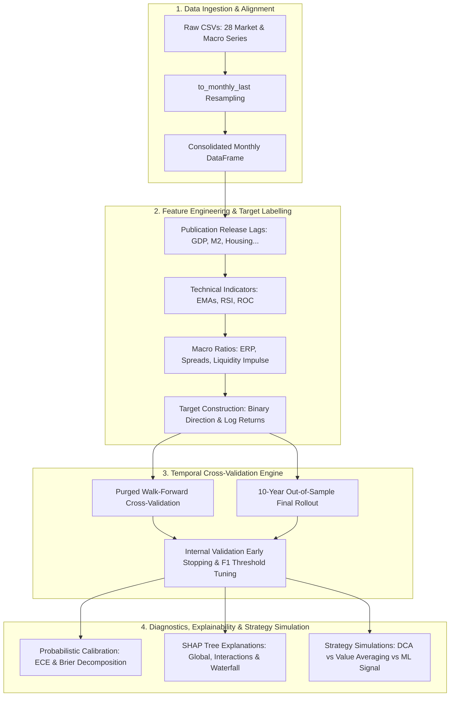

# Financial Machine Learning & Quantitative Prediction Engine

A time-aware, modular machine learning research framework for predicting macroeconomic regimes, financial market directions, and simulating quantitative investment strategies without lookahead bias.

---

## 🏛️ System Architecture



---

## 📁 Package Organization

```text
models/
├── src/                          # Core modular package
│   ├── config.py                 # Centralized configuration, horizons, paths & hyperparameters
│   ├── data_loader.py            # Ingestion, cleaning, frequency resampling & dataset merging
│   ├── features.py               # Technical indicators, macroeconomic release lags & target labelling
│   ├── metrics.py                # Probabilistic (ECE, Brier) and financial (CAGR, Sharpe, MDD) metrics
│   ├── simulation.py             # Strategy simulators (DCA, Value Averaging Modified, ML Allocation)
│   ├── plots.py                  # High-resolution diagnostic figures, calibration plots & scorecards
│   ├── tuning.py                 # Time-aware random search with temporal validation
│   ├── walk_forward.py           # Walk-forward validation engine with Purging and Embargo
│   ├── rollout.py                # 10-year out-of-sample rollout & regime stability evaluation
│   └── explainability.py         # Full model training, live inference & SHAP tree interpretability
│
├── data/                         # Historical market and macroeconomic data files
├── metrics/                      # Generated evaluation artifacts (scorecards, plots, tables)
├── backtest/                     # Classic strategy comparison artifacts
│
├── run_pipeline.py               # Main CLI orchestrator with stage-by-stage execution
├── predictions.py                # Clean entrypoint for full end-to-end pipeline execution
├── compare_strategies_simple.py  # Rule-based (RSI, MA) backtesting benchmark
└── get_data.py                   # Data acquisition and scraping utilities
```

---

## 🔬 Key Methodological Pillars

### 1. Zero Lookahead Bias & Realistic Release Lags
Macroeconomic indicators (e.g. GDP, Unemployment, Housing Starts, Money Supply) are shifted backwards according to real-world publication calendars before being combined with market prices.

### 2. Purged Walk-Forward Temporal Cross-Validation
Financial time series violate the I.I.D. assumption. To prevent information leakage caused by overlapping multi-month forward returns, training folds are purged of overlapping observations prior to each test fold.

### 3. Validation-Based Decision Threshold Optimization
Rather than assuming a rigid 0.5 classification threshold, optimal decision thresholds are calibrated purely on past out-of-sample validation folds to maximize F1 score.

### 4. Rigorous Probabilistic Calibration
Beyond standard accuracy, predictions are evaluated through:
- **Expected Calibration Error (ECE)**
- **Brier Score Decomposition:** $\text{Brier} = \text{Reliability} - \text{Resolution} + \text{Uncertainty}$
- **Decile Calibration Tables & Empirical Positive Capture Curves**

> [!WARNING]
> **Known Limitations:**
> The 36-month horizon over monthly data yields ~20 independent observations and an 82.9% base rate; reported metrics are point estimates without confidence intervals and should be read as directional, not conclusive. Feature selection was informed by full-sample analysis, so walk-forward results are optimistic.

### 5. SHAP Interpretability
Using `TreeExplainer`, model decisions are fully explained through:
- Global feature importance and beeswarm distributions
- Non-linear feature dependence and automatic interaction plots
- Waterfall decomposition for the latest live market observation

---

## 🚀 Usage & CLI Guide

### Run Complete Pipeline End-to-End
```bash
python models/predictions.py
```
*or via the CLI orchestrator:*
```bash
python models/run_pipeline.py --stage all
```

### Run Specific Stages
```bash
# 1. Exploratory Data Analysis & Feature Correlation Ranking:
python models/run_pipeline.py --stage eda

# 2. Walk-Forward Cross-Validation & Scorecards:
python models/run_pipeline.py --stage walk-forward

# 3. 10-Year Out-of-Sample Final Rollout:
python models/run_pipeline.py --stage rollout

# 4. Final Model Fitting & SHAP Interpretability:
python models/run_pipeline.py --stage explain
```

### Advanced CLI Arguments
```bash
python models/run_pipeline.py \
    --stage walk-forward \
    --horizon 36 \
    --start-date 1950-01-01 \
    --min-history 0.6 \
    --random-search
```

### Data Acquisition & Updates (`get_data.py`)
All 34 required historical datasets are stored directly in `models/data/`. To download or refresh datasets:
```bash
# Refresh all downloadable market and macroeconomic datasets:
python models/get_data.py --all

# Download or update specific data sources:
python models/get_data.py --source spy    # S&P 500 (SPY)
python models/get_data.py --source cape   # Shiller CAPE ratio
python models/get_data.py --source pmi    # ISM Manufacturing PMI
python models/get_data.py --source fred   # All St. Louis Fed FRED series
python models/get_data.py --source fred --fred-id M2SL  # Specific FRED series
```

---

## 📊 Generated Diagnostic Artifacts (`metrics/`)

| File | Description |
| --- | --- |
| `correlation_heatmap.png` | Pearson correlation matrix across active predictors and target |
| `spearman_rank_corr.png` | Monotonic rank correlation bar chart against forward returns |
| `walk_forward_metrics_scorecard.png` | Comprehensive average classification and probabilistic metrics table |
| `walk_forward_baselines_scorecard.png` | Model performance compared against constant base-rate baselines |
| `walk_forward_classification.png` | Timeline of price, forecast probability step curves, and hits/misses |
| `walk_forward_calibration.png` | Quantile calibration curve vs theoretical ideal |
| `walk_forward_roc_pr.png` | Dual ROC and Precision-Recall evaluation with baseline comparisons |
| `walk_forward_equity_curve_directional.png` | Continuous probability-weighted equity trajectory vs Buy & Hold |
| `roi_strategies_walk_forward.png` | Cumulative ROI (%) comparison: DCA vs Value Averaging vs ML Signal |
| `final_rollout_subperiod_metrics.png` | Subperiod stability breakdown (Early vs Late out-of-sample) |
| `shap_summary_cls.png` | Global SHAP beeswarm feature importance distribution |
| `shap_last_prediction_cls.png` | SHAP waterfall plot explaining the current live market forecast |
